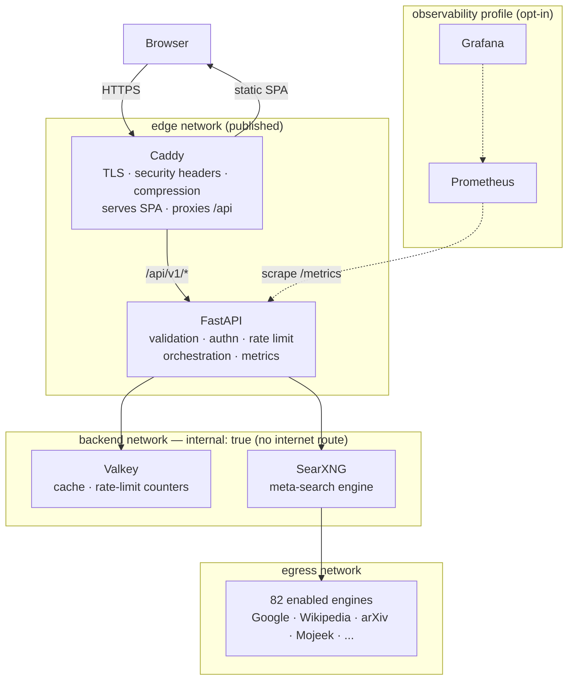
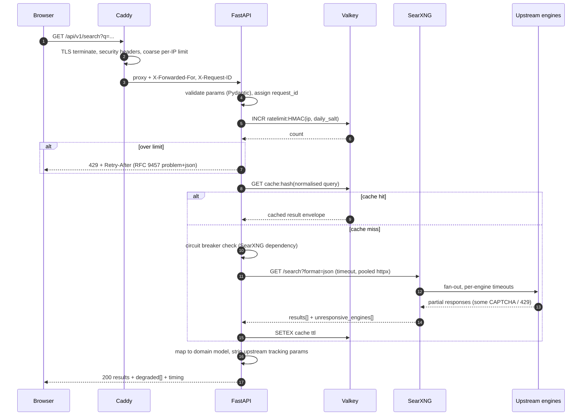

# Architecture

> Status: design baseline established in Phase 1. Every claim about SearXNG in this
> document was verified against image `searxng/searxng:2026.8.29-d226b78bc`, not taken
> from tutorials. Findings that contradict widely-circulated guides are called out.

## 1. What this system is

Veilix is a **privacy-first meta-search platform**. It does not crawl or index the
web. It forwards a query to many upstream search engines through SearXNG, merges the
results, and returns them without ever building a profile of the person asking.

The engineering value is not "a search box". It is the platform around SearXNG: a typed
API, an orchestration layer that degrades gracefully when upstreams fail, a
privacy-preserving rate limiter, network isolation that denies the API container
internet access entirely, and an observability stack that measures the system without
surveilling its users.

## 2. Component topology



**The most important edge in that diagram** is `A --> S`, because it is the *only* way
out of the API container. The API sits on `edge` and `backend`; `backend` is declared
`internal: true`, which strips its gateway. The API container therefore has **no route
to the internet at all**. If an attacker achieves code execution in the API process,
they cannot dial out. SearXNG is the only container that needs egress, and it is the
only one that has it.

## 3. Request flow — a single search



Step 12 is worth pausing on: upstream engines failing is the **normal case**, not the
exception (see §7). The response envelope carries a `degraded` list so the interface can
tell the user honestly which sources were unavailable.

## 4. Technology decisions

Each row states the decision, the reason, and what was rejected. Longer records live in
[`docs/adr/`](./adr/).

| Layer | Choice | Why | Rejected |
|---|---|---|---|
| Meta-search | **SearXNG** | Mature, AGPL, 272 engine integrations available, already solves result merging, scoring, and per-engine ban/suspend logic. Rewriting it would be the worst kind of not-invented-here. | Building a scraper fleet; YaCy (P2P, solves a different problem) |
| Reverse proxy | **Caddy** | Automatic ACME TLS with essentially no configuration, HTTP/3, declarative Caddyfile, and it serves the SPA itself — which saves a whole nginx container on a RAM-constrained host. | Nginx (manual certbot lifecycle); Traefik (label-driven config is powerful but opaque for a fixed five-service topology) |
| Backend | **Python 3.13 + FastAPI** | Async I/O suits a fan-out and aggregate workload; Pydantic gives request validation and OpenAPI generation from one set of type definitions. Same language as SearXNG, so one runtime to reason about. | Go (faster, but no schema-to-OpenAPI story this clean); Node (would add a third runtime) |
| Frontend | **React + TypeScript + Vite** | Static SPA output ships as files inside the Caddy image, so there is no Node process in production. | Next.js — an SSR server would see every query in plaintext, which is a privacy regression, not just extra weight |
| Datastore | **Valkey** | SearXNG's own settings key is `valkey:`, not `redis:` — upstream migrated. Wire-compatible with `redis-py`, so one datastore serves both cache and rate-limit counters. | Redis (still works, but tracking upstream avoids drift); Memcached (no atomic sliding-window primitives) |
| Relational DB | **None** | See below. | PostgreSQL |
| Metrics | **Prometheus + Grafana** | Pull-based scraping needs no user-identifying push payload; standard, free, self-hostable. | Hosted APM — sends telemetry off-box, which contradicts the product |
| Tracing | **OpenTelemetry SDK, exporter opt-in** | Instrument once, export only when a collector is configured. No collector container by default. | Always-on Jaeger — two more containers on a 2.77 GiB Docker VM |

### Why there is no PostgreSQL

The brief warns against adding Postgres for appearances, so here is the honest analysis.

The system's persistent state is exactly two things: **API key material** and **admin
credentials**. Both are low-cardinality, change rarely, and are operator-managed rather
than user-generated. Both are handled as Argon2 hashes supplied through environment
configuration and validated at startup.

Search history is the one dataset that *would* justify a relational store, and storing
it is precisely what this product refuses to do. Adding Postgres would mean running,
backing up, patching, and monitoring a stateful service in order to hold roughly two
rows.

**The trigger that would reverse this decision**: self-service API key issuance for
third-party developers, where keys need per-tenant quotas, rotation history, and an
audit trail. At that point Postgres earns its place. Until then it is operational
burden without a workload.

## 5. Backend structure

Clean architecture with dependencies pointing inward. The domain layer knows nothing
about SearXNG, HTTP, or Valkey.

```
apps/api/src/veilix/
├── main.py               app factory + lifespan only, no business logic
├── core/
│   ├── config.py         pydantic-settings; fails fast on invalid config
│   ├── logging.py        structlog to JSON, request_id bound to context
│   ├── errors.py         error taxonomy mapped to RFC 9457 problem+json
│   ├── security.py       API-key and admin authentication
│   └── telemetry.py      Prometheus registry + OpenTelemetry setup
├── api/v1/               HTTP layer: routing, status codes, DTO in and out
├── schemas/              Pydantic request/response DTOs — the public contract
├── domain/               provider-agnostic entities; imports nothing from infra
├── services/             orchestration; the only layer that composes providers
├── providers/
│   ├── base.py           SearchProvider Protocol
│   └── searxng.py        the one implementation today
└── infrastructure/       cache, rate limiter, pooled HTTP client, breaker
```

`providers/base.py` is the seam that keeps the system extensible. A future local
semantic-search or summarisation stage plugs in behind the same Protocol without the API
or domain layers changing. That is the entirety of the "AI-ready" requirement — an
interface, not speculative infrastructure.

### Engines: 272 available, 82 enabled

SearXNG ships 272 engine definitions. Veilix enables 82 of them, which is
upstream's default set plus three independent indexes (mojeek, qwant, mwmbl)
and minus four torrent engines. `infra/searxng/settings.yml` records why.

Numbers elsewhere in this repository refer to the enabled set unless they say
otherwise.

## 6. Verified SearXNG facts that drive the design

Confirmed by running and probing the image. Several contradict popular guides.

1. **The server is Granian, not uWSGI.** Configuration is via `GRANIAN_*` environment
   variables. Any guide telling you to author a `uwsgi.ini` is out of date.
2. **`valkey:`, not `redis:`** — the settings key and the `SEARXNG_VALKEY_URL` variable.
3. **JSON output is disabled by default** (`formats: [html]`) and must be explicitly
   enabled for a programmatic client. That upstream default exists because a public JSON
   endpoint is trivially abusable, which is exactly why our SearXNG is never published (§8).
4. **The container runs as root** and does not drop privileges; the entrypoint `chown`s
   config, then `exec`s Granian directly. Hardening is our responsibility — Phase 5.
5. `number_of_results` came back `null` on a live general query. We therefore report
   *results returned on this page* and never fabricate a web-scale total.
6. `/config` exposes all 272 engine definitions with real capability flags (`paging`,
   `time_range_support`, `safesearch`, `languages`). The interface drives its filter
   affordances from this live data rather than a hardcoded list that would silently rot.
7. Image results carry third-party `img_src` URLs. Rendering them directly would make
   the user's browser connect to `cdn.jsdelivr.net`, `gstatic.com` and similar, leaking IP
   and referrer to hosts the user never chose. SearXNG's `image_proxy` exists for this and
   will be enabled (§9).

## 7. Failure is the normal case

A live probe against a clean instance returned this in `unresponsive_engines`:

```
[['brave',      'Suspended: too many requests'],
 ['duckduckgo', 'CAPTCHA'],
 ['startpage',  'Suspended: CAPTCHA']]
```

Three of the best-known engines, unavailable, on the very first query — because
self-hosted meta-search instances get rate-limited and CAPTCHA-walled by upstreams. This
is not a hypothetical reliability chapter. It is the steady state.

What follows from that:

- **Partial results are a first-class success**, not an error. Twenty usable results with
  three engines down is a 200, with the degradation reported in the envelope.
- Do not reimplement per-engine circuit breaking. SearXNG already has
  `ban_time_on_fail`, `max_ban_time_on_fail`, and `suspended_times` (CAPTCHA to 3600s,
  Cloudflare CAPTCHA to 1296000s). Duplicating that in the orchestrator would be redundant
  machinery fighting the layer below it.
- **One circuit breaker, at the right level**: around the *SearXNG dependency itself*,
  protecting the API from a wedged or overloaded instance.
- Provider health telemetry comes from `unresponsive_engines` — real measured data,
 , not synthetic health checks.

## 8. Security model (design level)

The full threat model and hardening work land in Phase 5. These are the structural
decisions taken now.

**Trust boundaries.** The internet reaches exactly one container: Caddy. Everything else
is unpublished. SearXNG's JSON API — dangerous to expose publicly — is reachable only
from the API container, over an internal network.

**SearXNG's own limiter is deliberately OFF.** Its bot detection identifies clients by
IP, and in this architecture every request arrives from a single source: the API
container. The limiter would see one client generating all traffic and would either
throttle the whole instance or do nothing useful. Rate limiting belongs where real client
identity exists, which is the edge. This default is safe *only because* SearXNG is
unreachable from outside; if that ever changes, the limiter must be enabled in the same
commit.

**Defence in depth:**

| Layer | Control |
|---|---|
| Caddy | TLS, HSTS, CSP, `X-Content-Type-Options`, `Referrer-Policy`, request body caps, coarse per-IP limits |
| FastAPI | Pydantic validation on every parameter, per-identity sliding-window limiter, API-key auth on protected routes, admin auth, request size limits |
| Network | `internal: true` backend network — the API container has no internet route |
| Container | non-root where achievable, read-only root filesystem, dropped capabilities, `no-new-privileges`, pinned image digests |
| Supply chain | pinned dependencies, `pip-audit` and `npm audit`, Trivy image scanning in CI |

**SSRF, assessed honestly.** The API fetches exactly one hardcoded internal URL taken
from configuration. No endpoint accepts a user-supplied URL and fetches it, so the
classic SSRF surface does not exist in the API — and the internal-network isolation means
even a successful one could reach neither cloud metadata endpoints nor the internet. The
genuine outbound-fetch surface is SearXNG's image proxy, which fetches result-supplied
URLs; upstream mitigates this by HMAC-signing proxied URLs so that only URLs SearXNG
itself emitted can be requested. This is documented instead of papered over with SSRF
defences for requests we never make.

## 9. Privacy model (design level)

Detailed in [`docs/privacy.md`](./privacy.md). The structural commitments:

**Not collected, by construction:** no accounts, no identity cookies, no cross-request
user identifier, no search history, no behavioural profile, no advertising, no
third-party analytics.

**Rate limiting without storing IP addresses.** Limiting requires distinguishing clients,
and clients are identified by IP — an unavoidable tension. The resolution: the raw IP is
never written anywhere. The limiter key is `HMAC-SHA256(ip, daily_rotating_salt)`,
truncated, with a TTL matching the limit window. The salt rotates daily and is never
persisted, so yesterday's keys become permanently unlinkable to any address. The API can
count you; it cannot remember you.

Cache privacy, with its trade-off stated. The cache key is a hash of the *normalised
query parameters only*, with no identity component, so entries are shared across all
users — which is what makes the cache privacy-compatible in the first place. The honest
cost: a shared cache is a timing side channel. Someone able to measure response latency
can infer that *somebody* recently searched a given term. They learn nothing about who.
The mitigation is a short TTL bounding the observation window, and the cache can be
disabled by configuration. This trade-off is documented, not hidden, and a
millisecond latency win is not treated as automatically worth it.

**Image proxying is enabled**, so result thumbnails are fetched by the server rather than
by the user's browser. The cost is our bandwidth and CPU. The benefit is that third-party
image hosts never see the user's IP.

What the operator can still technically observe. Being straight about the limits:
Caddy terminates TLS and therefore handles plaintext queries in memory; the API process
sees every query; upstream engines see the query text and our server's IP. We reduce what
is *retained* to near zero, but a self-hosted meta-search engine cannot make its own
operator blind. Claiming "100% anonymous" would be false, and this project does not claim
it.

## 10. Resource-aware deployment

The development host has 5.9 GB of RAM and a 2.77 GiB Docker VM shared with unrelated
projects. That constraint produced a split that is good practice regardless:

- **Core profile** — Caddy, API, SearXNG, Valkey. Four containers. The SPA is baked into
  the Caddy image, so there is no fifth container merely to serve static files.
- **`--profile observability`** — Prometheus and Grafana, opt-in.

Any target smaller than the core profile would not run the stack at all, so that profile
doubles as the honest minimum-spec statement.

## 11. Known limitations

- Upstream engines rate-limit self-hosted instances, so result quality on a single small
  instance is below that of a large public one. This is inherent to self-hosting.
- No horizontal scaling story is implemented at this stage. The design is
  scale-*ready* — stateless API, shared Valkey — but running multiple replicas behind a
  load balancer has not been built or measured, and will not be claimed.
- Load-test figures produced on this host reflect a 2.77 GiB Docker VM shared with other
  workloads. They will be reported as environment-limited measurements and must not be
  read as throughput claims.
